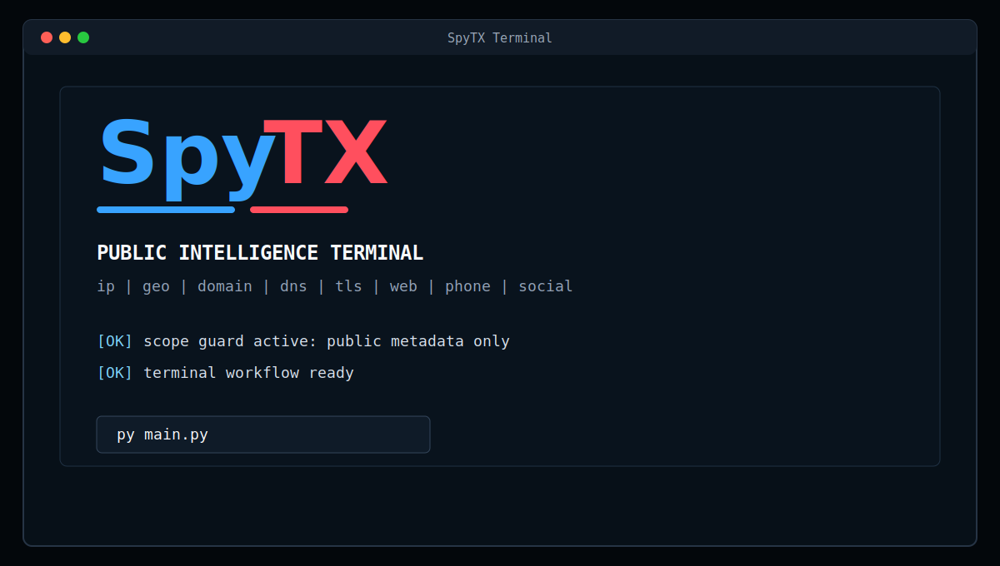
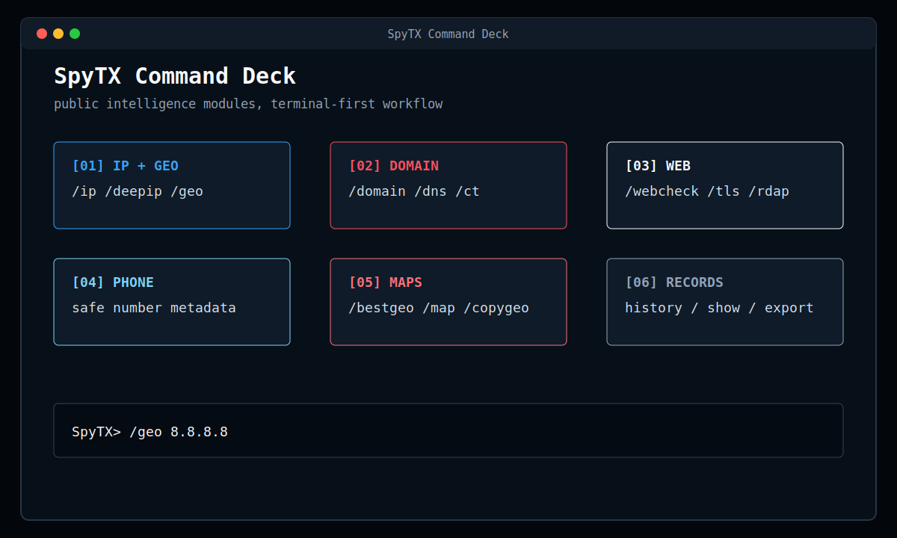
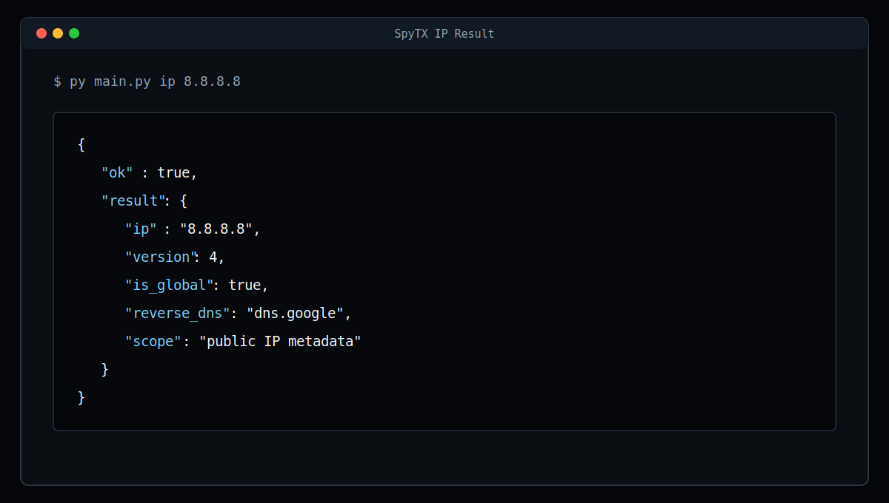
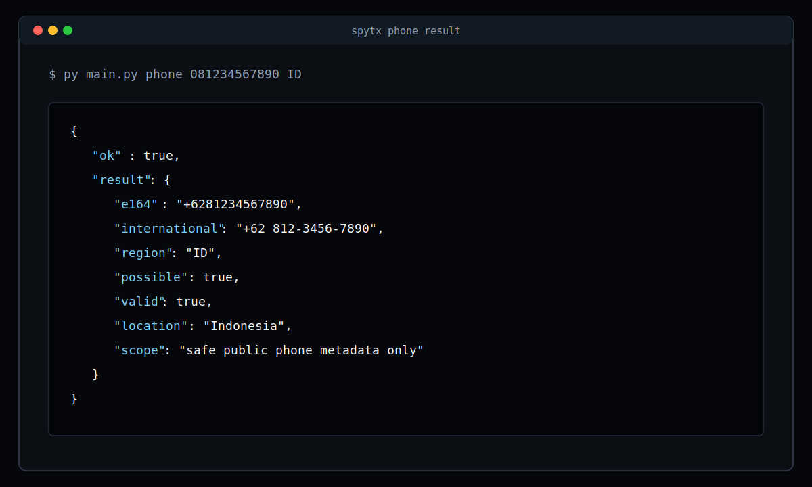

# SpyTX

SpyTX is a clean public-intelligence terminal toolkit for IP, domain, DNS, TLS,
web posture, username, and phone-number metadata checks.

It uses public network data, local parsing, and safe metadata only. It does not
use private databases, secret tokens, tag/profile lookups, account bypasses, or
phone-to-person matching.

## Screenshots

### Boot



### Dashboard



### IP Metadata



### Phone Metadata



## Install

```powershell
py -m pip install -r requirements.txt
py main.py
```

## Commands

Interactive terminal:

```powershell
py main.py
```

Direct commands:

```powershell
py main.py ip 8.8.8.8
py main.py domain example.com
py main.py dns example.com
py main.py tls example.com
py main.py web example.com
py main.py phone +628123456789
py main.py username syntx404
```

## Python

```python
from spytx import inspect_phone

result = inspect_phone("+628123456789")
print(result["e164"])
```

## Scope

- IP and domain checks are public network intelligence.
- Phone checks are validation and carrier/region metadata when available.
- Username checks generate public profile review links only.
- Reports are JSON by default for easy auditing.

## Tests

```powershell
py -m unittest discover -s tests
```
